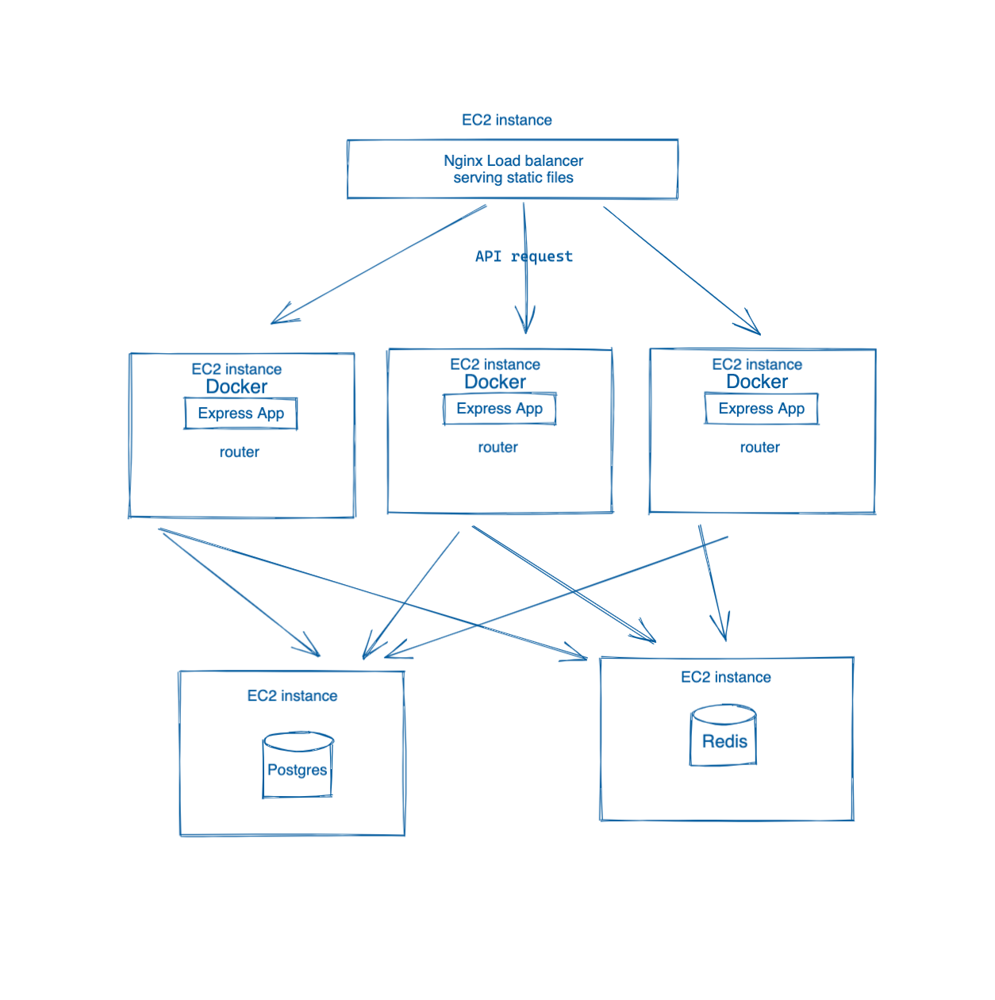
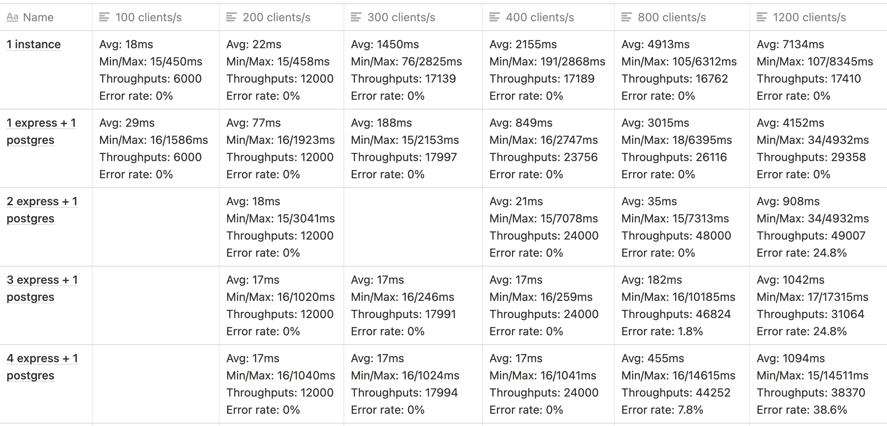

### System Design
An API microservice that supports the products and product styles component of a large front-end e-commerce website.
### Technology Stack
* Node.js
* Express
* Jest
* PostgreSQL
* Nginx
* Docker
* Redis
* AWS EC2

### Architecture Diagram

### Throughputs Result
